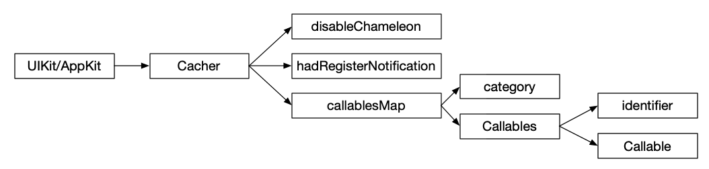
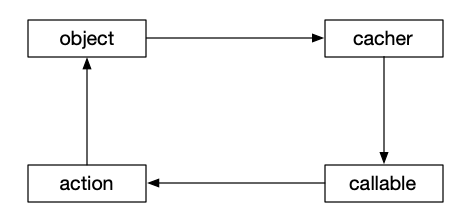
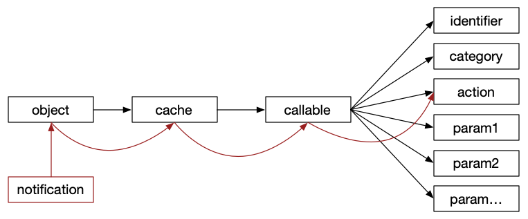

# Chameleon


## 0x00 简介

iOS/macOS 换肤(主题)框架，支持动态换肤与自定义属性，同时也支持无侵入式换肤(swizzling)。

## 0x01原理

基本的实现原理就是方法的缓存，将支持换肤的属性或者方法缓存起来，在执行换肤的时候，内部发送通知，让所有组件切换对应的主题资源。



如图，将换肤相关的数据都缓存在一个关联对象`Cacher`中(`associated object`)。

### 0x01.1 方法缓存

上面也说了，原理就是方法缓存然后回放，这是对每个支持换肤的UI组件来做的category，因为不同属性的设置参数有所不同，所以提供了带有1～5个入参的缓存方法(目前来看4个入参的就算多的了，基本都是一个)，在`NSObject+Cache.swift`文件中如:

```swift
@discardableResult
func cache<A, B>(
    firstParam: A, secondParam: B,
    identifier: AppearanceCallableIdentifier,
    action: @escaping ((A.InputType, B.InputType) -> Void),
    category: String = AppearanceDefaultCallableCategory
) -> Callable.Two<A, B> where A: AppearancedProtocol, B: AppearancedProtocol {
    return cache(appearanceCallable: Callable.Two(
        firstParam: firstParam,
        secondParam: secondParam,
        identifier: identifier,
        action: action,
        category: category
    ))
}
```

对于UIButton的标题颜色设置方法`setTitleColor(_:for:)`，包含有两个入参，缓存的时候就可以这样：

```swift
cache(
    firstParam: Callable.Appearanced(titleColor),
    secondParam: Callable.Original(state),
    identifier: .setTitleColorForState,
    action: { [weak self] va, vb in self?.__setTitleColor(va, for: vb) },
    category: "UIButton.state:\(state.rawValue)"
)
```

那么在内部就会创建一个对应的`Callable`对象缓存到`Cacher`里。

这里的几个参数需要特别解释一下：

#### 0x01.1.1 `identifier`

当前换肤方法的唯一标识符，唯一的标识着这个换肤状态，比如对于`UIView`可以设置`backgroundColor`和`tintColor`属性，如果不做特殊标识，那么在做方法缓存时时没法做到多个缓存的，当然也可以放到数组中，但是，如果重复设置的话， 也一样时没法区分。

#### 0x01.1.2 `category`

方法的分类，比如`UIButton`的设置标题颜色的方法`setTitleColor(_:for:)`，根据第二个参数`state`的不同，会有多种结果，为了保持统一性，加了一个`category`来做不同状态的划分，这样以来缓存的数据结构就会比较清晰。如：

```
UIButton
  |-- normal
  |     |-- titleColor
  |     |-- image
  |     |-- attributedTitle
  |     |-- backgroundImage
  |-- disable
  |     |-- titleColor
  |     |-- image
  |     |-- attributedTitle
  |     |-- backgroundImage
  ....
```

#### 0x01.1.3 `action`

在换肤后执行换肤属性的设置的时候执行的`swift`方法，这个方法的入参和缓存时的入参数量、类型必须保持一致，否则Xcode会报错。这个也需要特别注意，如果直接缓存的是方法的话，会导致循环引用出现无法被释放的情况，如：

```
cache(
    firstParam: Callable.Appearanced(backgroundColor),
    identifier: .backgroundColor,
    action: __setBackgroundColor(_:)
)
```

那么当前对象在初始化后出现以下情况无法被释放：



所以这里缓存的方法，需要用一个闭包转一下，如 `{ [weak self] va in self?.__setBackgroundColor(va) }`。


### 0x01.2 执行换肤

执行换肤时，只需要把换肤资源设置进Chameleon中就行了：

```swift
AppearanceManager.shared.changeThemeWith(themeInfo: ThemeInfo.theme0)
```

在内部就会自动清理上个主题的缓存，然后执行换肤操作：



框架内部会发送一个通知 `AppearanceManager.appearanceChanged` 通知所有的UI组件执行换肤操作，UI组件在接收到消息后，会逐步的遍历查找缓存的`callables`，然后执行换肤属性的设置操作：

```swift
private extension NSObject {
    @objc func performThemeChangedAction(_ notification: Notification) {
        for (_, callables) in cacher.callablesMap {
            for (_, callable) in callables {
                callable.execute(withoutChameleon: false)
            }
        }
    }
}
```

**注意**，这里的UI组件是在上一步做方法缓存的时候添加的监听：

```
/// 缓存一个换肤方法执行对象，缓存的同时会执行一次用于设置初始的皮肤属性
/// - Parameter appearanceCallable: 换肤方法执行对象
/// - Returns: 缓存的原始值
@discardableResult
func cache<T>(appearanceCallable: T) -> T where T: CallableProtocol {
    .....

    if !cacher.hadRegisterNotification {
--->    AppearanceManager.shared.registerAppearanceObserver(self, action: #selector(performThemeChangedAction))
        cacher.hadRegisterNotification = true
    }

    return appearanceCallable
}
```

所以，外部是不需要管什么的，如果自己也想接收一下换肤的通知的话，也可以：

```
AppearanceManager.shared.notificationCenter.addObserver(observer, selector: #selector(your objc selector), name: AppearanceManager.appearanceChanged, object: nil)
```

### 0x01.3 `Callable`s

`Callable`被定义为可执行方法的缓存对象，用于缓存可执行的换肤方法的所有参数信息和标识信息，所有的`Callable`都必须实现`CallableProtocol`协议，用来限定一些基本的操作：

```
/// 换肤方法的执行对象
public protocol CallableProtocol {
    
    /// 当前执行对象的分类，可选值
    var category: AppearanceCallableCategory { get }
    
    /// 当前执行对象的唯一标识符，用于保证缓存执行对象只会存在一份
    var identifier: AppearanceCallableIdentifier { get }
    
    /// 在执行换肤的时候由框架内统一调用的方法，用于通知所有需要换肤的组件执行换肤的操作
    func execute(withoutChameleon: Bool)
    
    /// 当前缓存的换肤方法执行对象是否支持换肤，只要缓存的参数中有一个属性支持换肤，那么即算是支持
    /// 对于不支持换肤的执行对象，就没必要缓存
    var isAppearanced: Bool { get }
}
```

在`0x01.2`中执行换肤时调用的就是`func execute(withoutChameleon: Bool)`方法。

在整个框架内部目前有5种`Callable`，即`Callable.One`、`Callab.Two`、`Callab.Three`、`Callab.Four`、`Callab.Five`分别对应带有1～5个入参的换肤方法，每个`Callable`在实现上述协议的同时，会带有不同数量的`param`，分别对应第1到第5个入参，每个入参都必须实现`AppearancedProtocol`协议，用于统一的约定一些资源查找方法。

（如果后续存在更多入参的换肤方法的话，还可以继续增加`Callable`）


### 0x01.4 `Appearance`

在上一步中，每个`Callable`都会有1个或者多个`param`，这里的每个`param`都实现了`AppearancedProtocol`，用于限定每个换肤属性的基本参数和类型，我们可以把它叫做`Appearance`：

```swift
public protocol AppearancedProtocol {
    
    /// 缓存当前入参的数据类型
    associatedtype InputType
    
    /// 缓存的原始参数值
    var original: InputType { get }
    
    /// 是否是支持换肤的属性
    var isAppearanced: Bool { get }
    
    /// 根据当前参数数据从换肤资源中获取对应有效的换肤数据
    var correct: InputType { get }
}
```

目前在整个框架内部规定了5种行为的`Appearance`：

- `Appearance`
- `Attributed`
- `Collection`
- `Customized`
- `Original`

下面对每种`Appearance`做一下简单的介绍：

#### 0x01.3.1 `Appearanced`

一些基本换肤属性的`Appearance`，支持`Color`、`Image`、常用数值类型等数据类型，该类有一个`identifier`属性，用于从主题资源中找到对应的换肤资源，如果没有设置，会直接返回原始值。

#### 0x01.3.2 `Attributed`

富文本处理的`Appearance`，因为富文本的换肤属性是在内部的不同位置，没法直接获取，所以需要单独的处理。

在初始化的时候会遍历所有的`attributes`，目前只会遍历颜色属性的`Attributes`，然后把支持换肤的区间信息缓存起来：

```
/// 缓存颜色属性的位置信息
struct ColorElement {
    /// 颜色值
    let color: NSUIAppearanceColor
    /// 换肤的颜色属性标识
    let identifier: AppearanceCallableIdentifier
    /// 颜色属性的位置
    let range: NSRange
}
```

在换肤的时候再遍历所有的区间信息，然后把对应的颜色属性设置上去。

#### 0x01.3.3 `Collection`

处理集合类的`Appearance`，如带有换肤属性的数组、字典，初始化后会把所有元素处理成`Appearanced`，在换肤的时候再把所有的属性设置回去。

#### 0x01.3.4 `Customized`

自定义换肤属性的`Appearance`，支持用户自定义换肤属性：

```swift
/// 初始化方法
/// - Parameters:
///   - original: 原始值
///   - identifier: 当前自定义富文本的换肤资源ID
///   - converter: 转换方法，将主题资源中的数据转换为对应的有效皮肤信息
public init(_ original: T, identifier: AppearanceCallableIdentifier?, converter: @escaping (Any?) -> T?)
```

比如对NSBox添加一个自定义的换肤属性，这样就可以通过主题切换来动态设置`borderWidth`：

```swift
cache(appearanceCallable: Callable.One(
    firstParam: Callable.Appearanced(newValue, identifier: "others/border/width"),
    identifier: "NSBox.__setBorderWidth(_:)",
    action: { [weak self] va in self?.__setBorderWidth(va) })
)
```

#### 0x01.3.5 `Original`

过渡的中间类，不需要执行换肤操作的`Appearance`。

### 0x01.4 主题资源

主题资源是指规定了app中各处UI组件的颜色、图片、样式等的数据，可以打包成bundle、动态从网上下载、打包到app内等，注册到换肤框架内的只需要主题资源的数据字典和对应图片资源的目录。
这里我们先看一个资源示例：

```
{
    "color": {
        "text": {
            "C001": "B17936 0.9",
            "C002": "rgba<254,220,189,0.9>",
            "C003": "rgba<244,121,32,0.9>",
            "C004": "hex<905A3D 0.9>",
            "C005": "hex<B2D235 0.9>",
            "C006": "hex<A3CF62>",
            "C007": "694D9F"
        },
        "background": {
            "C101": "5F5D46",
            "C102": "525F42",
            "C103": "random",
            "C104": "6E6B41",
        }
    },
    "image": {
        "no01": "home_house_icon_251952",
        "no02": "human_handsup_icon_251948",
        "no03": "mood_happy_icon_251870"
    },
    "others": {
        "border": {
            "width": 2
        },
        "imageView": {
            "animationDuration": 3,
            "animationRepeatCount": 5
        }
    }
}
```

不同的主题对应不同的资源，格式随便，只要你能解析为有效的字典格式的内容就行。

通用的换肤属性包括颜色、图片两种，支持以下写法：

1. 颜色，以下写法都能正常解析为对应的颜色值
   - `694D9F`
   - `B17936 0.9`
   - `rgba<254,220,189,0.9>`
   - `rgba<254,220,189>`
   - `hex<B2D235 0.9>`
   - `hex<B2D235>`

2. 图片
   - 字符串类型
     - `imagename`，会直接使用`imageNamed`方法来获取对应的图片
     - `file://imagename`，会通过`imageWithContentsFile`读取文件的方法来读取对应的图片
   - 字典类型，包含以下key时，使用对应的方法获取图片
     - `name`，会直接使用`imageNamed`方法来获取对应的图片
     - `file`，会通过`imageWithContentsFile`读取文件的方法来读取对应的图片
     - `color`，会通过给定的颜色值来生成一个纯色的图片

### 0x01.5 推荐的资源管理方式

不同主题的资源分开管理：

```
themes
  |-- theme0
  |     |-- theme0.json
  |     |-- resources
  |     |     |-- image0 
  |     |     |-- image1
  |     |     |-- ...
  |-- theme1
  |     |-- theme1.json
  |     |-- resources
  |     |     |-- image0 
  |     |     |-- image1
  |     |     |-- ...
  ....
```
